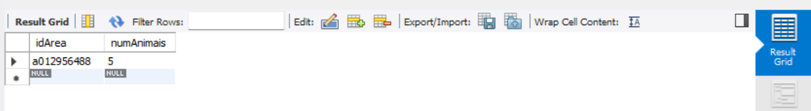
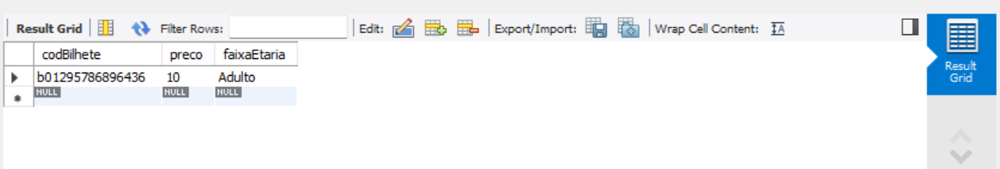

# C3 : SQL

## DDL


```sql
USE `test`;

DROP TABLE IF EXISTS `tabela_a`;
DROP TABLE IF EXISTS `tabela_b`;
DROP TABLE IF EXISTS `tabela_c`;
DROP TABLE IF EXISTS `tabela_d`;
DROP TABLE IF EXISTS `tabela_e`;
DROP TABLE IF EXISTS `tabela_f`;
DROP TABLE IF EXISTS `tabela_g`;
DROP TABLE IF EXISTS `tabela_h`;
DROP TABLE IF EXISTS `tabela_i`;
DROP TABLE IF EXISTS `tabela_j`;

CREATE TABLE IF NOT EXISTS `tabela_a` (
  `codAnimal` char(10) NOT NULL,
  `peso` decimal unsigned NOT NULL,
  `idade` smallint unsigned NOT NULL,
  `nome` varchar(50) NOT NULL,
  `dataNasc` datetime NOT NULL,
  `dataObito` datetime NOT NULL,
  PRIMARY KEY (`codAnimal`)
);

CREATE TABLE IF NOT EXISTS `tabela_b` (
  `idSetor` char(10) NOT NULL,
  `local` varchar(50) NOT NULL,
  `tema` varchar(50) NOT NULL,
  PRIMARY KEY (`idSetor`)
);

CREATE TABLE IF NOT EXISTS `tabela_c` (
  `idEspecie` char(10) NOT NULL,
  `nome` varchar(20) NOT NULL,
  `quantidadeComida` int unsigned NOT NULL,
  `dieta` varchar(20) NOT NULL,
  `tipo` varchar(20) NOT NULL,
  PRIMARY KEY (`idEspecie`)
);

CREATE TABLE IF NOT EXISTS `tabela_d` (
  `idVac` char(10) NOT NULL,
  `nomeVac` varchar(50) NOT NULL,
  PRIMARY KEY (`idVac`)
);

CREATE TABLE IF NOT EXISTS `tabela_e` (
  `idArea` char(10) NOT NULL,
  `numAnimais` smallint unsigned NOT NULL,
  PRIMARY KEY (`idArea`)
);

CREATE TABLE IF NOT EXISTS `tabela_f` (
  `codFuncionario` char(10) NOT NULL,
  `nome` varchar(50) NOT NULL,
  `CC` char(12) NOT NULL,
  `contacto` tinyint unsigned NOT NULL,
  `horaEntrada` time NOT NULL,
  `horaSaida` time NOT NULL,
  `data` date NOT NULL,
  `funcao` varchar(50) NOT NULL,
  PRIMARY KEY (`codFuncionario`)
);

CREATE TABLE IF NOT EXISTS `tabela_g` (
  `codBilhete` char(15) NOT NULL,
  `preco` float unsigned NOT NULL,
  `faixaEtaria` varchar(10) NOT NULL,
  PRIMARY KEY (`codBilhete`)
);

CREATE TABLE IF NOT EXISTS `tabela_h` (
  `nomeDesconto` varchar(50) NOT NULL,
  `valor` tinyint NOT NULL,
  PRIMARY KEY (`nomeDesconto`)
);

CREATE TABLE IF NOT EXISTS `tabela_i` (
  `idVG` char(10) NOT NULL,
  `nome` varchar(30) NOT NULL,
  `numeroParticipantes` tinyint unsigned NOT NULL,
  `horaEntrada` time NOT NULL,
  `horaSaida` time NOT NULL,
  `data` date NOT NULL,
  PRIMARY KEY (`idVG`)
);

CREATE TABLE IF NOT EXISTS `tabela_j` (
  `idCliente` char(10) NOT NULL,
  `nome` varchar(50) NOT NULL,
  `idade` tinyint unsigned NOT NULL,
  `email` varchar(50) NOT NULL,
  `cc` char(12) NOT NULL,
  `contacto` char(9) NOT NULL,
  PRIMARY KEY (`idCliente`)
);
```

## DML

### Tabela_a

  

### Tabela_b

  

### Tabela_c

  

### Tabela_d

  

### Tabela_e

  

### Tabela_f

  

### Tabela_g

  

### Tabela_h

  

### Tabela_i

 

### Tabela_j

  

---
[< Previous](rebd04.md) | [^ Main]() | Next >
:--- | :---: | ---: 

