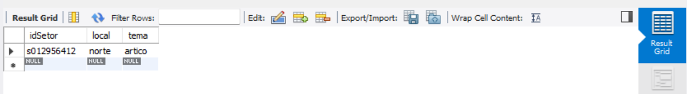
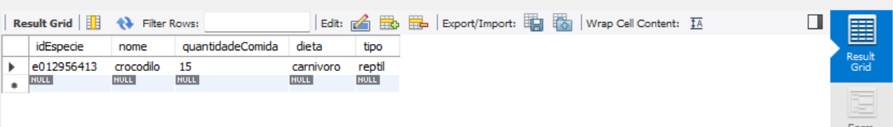
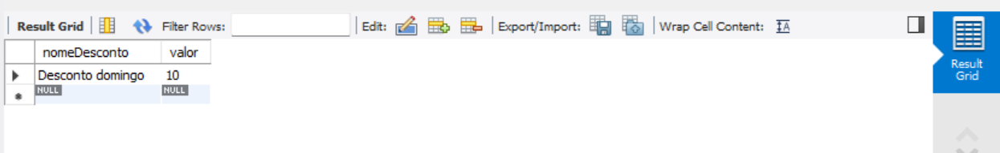

# C3 : SQL

## DDL


```sql
USE `test`;

DROP TABLE IF EXISTS `ANIMAL`;
DROP TABLE IF EXISTS `SETOR`;
DROP TABLE IF EXISTS `ESPECIE`;
DROP TABLE IF EXISTS `VACINA`;
DROP TABLE IF EXISTS `AREA`;
DROP TABLE IF EXISTS `FUNCIONARIO`;
DROP TABLE IF EXISTS `BILHETE`;
DROP TABLE IF EXISTS `DESCONTO`;
DROP TABLE IF EXISTS `VISITASGRUPO`;
DROP TABLE IF EXISTS `CLIENTE`;
DROP TABLE IF EXISTS `APADINHAR`;

CREATE TABLE IF NOT EXISTS `ANIMAL` (
  `codAnimal` char(10) NOT NULL,
  `peso` decimal NOT NULL,
  `idade` smallint unsigned NOT NULL,
  `nome` varchar(50) NOT NULL,
  `dataNasc` datetime NOT NULL,
  `dataObito` datetime NOT NULL,
  PRIMARY KEY (`codAnimal`)
);

CREATE TABLE IF NOT EXISTS `SETOR` (
  `idSetor` char(10) NOT NULL,
  `local` varchar(50) NOT NULL,
  `tema` varchar(50) NOT NULL,
  PRIMARY KEY (`idSetor`)
);

CREATE TABLE IF NOT EXISTS `ESPECIE` (
  `idEspecie` char(10) NOT NULL,
  `nome` varchar(20) NOT NULL,
  `quantidadeComida` int unsigned NOT NULL,
  `dieta` varchar(20) NOT NULL,
  `tipo` varchar(20) NOT NULL,
  PRIMARY KEY (`idEspecie`)
);

CREATE TABLE IF NOT EXISTS `VACINA` (
  `idVac` char(10) NOT NULL,
  `nomeVac` varchar(50) NOT NULL,
  PRIMARY KEY (`idVac`)
);

CREATE TABLE IF NOT EXISTS `AREA` (
  `idArea` char(10) NOT NULL,
  `numAnimais` smallint unsigned NOT NULL,
  PRIMARY KEY (`idArea`)
);

CREATE TABLE IF NOT EXISTS `FUNCIONARIO` (
  `codFuncionario` char(10) NOT NULL,
  `nome` varchar(50) NOT NULL,
  `cc` char(12) NOT NULL,
  `contacto` char(9) NOT NULL,
  `horaEntrada` time NOT NULL,
  `horaSaida` time NOT NULL,
  `data` date NOT NULL,
  `funcao` varchar(50) NOT NULL,
  PRIMARY KEY (`codFuncionario`)
);

CREATE TABLE IF NOT EXISTS `BILHETE` (
  `codBilhete` char(15) NOT NULL,
  `preco` float unsigned NOT NULL,
  `faixaEtaria` varchar(10) NOT NULL,
  PRIMARY KEY (`codBilhete`)
);

CREATE TABLE IF NOT EXISTS `DESCONTO` (
  `nomeDesconto` varchar(50) NOT NULL,
  `valor` tinyint NOT NULL,
  PRIMARY KEY (`nomeDesconto`)
);

CREATE TABLE IF NOT EXISTS `VISITASGRUPO` (
  `idVG` char(10) NOT NULL,
  `nome` varchar(30) NOT NULL,
  `numeroParticipantes` tinyint unsigned NOT NULL,
  `horaEntrada` time NOT NULL,
  `horaSaida` time NOT NULL,
  `data` date NOT NULL,
  PRIMARY KEY (`idVG`)
);

CREATE TABLE IF NOT EXISTS `CLIENTE` (
  `idCliente` char(10) NOT NULL,
  `nome` varchar(50) NOT NULL,
  `idade` tinyint unsigned NOT NULL,
  `email` varchar(50) NULL,
  `cc` char(12) NOT NULL,
  `contacto` char(9) NULL,
  PRIMARY KEY (`idCliente`)
);

CREATE TABLE IF NOT EXISTS `APADRINHA` (
  `valor` float NULL,
);
```

## DML

Nos exemplos pretendemos inserir dados em todas as colunas e esperávamos que nos mostrasse a linha criada.

### ANIMAL
```sql
insert into `ANIMAL` values('8012345678', '500', '20', 'crocodylus', '2022-10-21 04:30:01', '2022-05-13 12:23:43');
SELECT * FROM `ANIMAL`;
```
  

### SETOR
```sql
insert into `SETOR`values('s012956412', 'norte', 'artico');
SELECT * FROM `SETOR`;
```
  

### ESPECIE
```sql
insert into `ESPECIE`values('e012956413', 'crocodilo', '15', 'carnivoro', 'reptil');
SELECT * FROM `ESPECIE`;
```
  

### VACINA
```sql
insert into `VACINA`values('v012956478', 'raiva');
SELECT * FROM `VACINA`;
```
  

### AREA
```sql
insert into `AREA`values('a012956488', '5');
SELECT * FROM `AREA`;
```
  

### FUNCIONARIO
```sql
insert into `FUNCIONARIO`values('f012956999', 'Duarte Lopes', '456723879ZX9', '937659233', '08:30:00', '18:30:00', '2022-04-21', 'tratador');
SELECT * FROM `FUNCIONARIO`;
```
  

### BILHETE
```sql
insert into `BILHETE`values('b01295786896436', '10', 'Adulto');
SELECT * FROM `BILHETE`;
```
  

### DESCONTO
```sql
insert into `DESCONTO`values('Desconto domingo', '10');
SELECT * FROM `DESCONTO`;
```
  

### VISITAS GRUPO
```sql
insert into `VISITASGRUPO`values('v123454876', 'Rapozas', '20', '09:00:00', '11:00:00', '2022-08-24');
SELECT * FROM `VISITASGRUPO`;
```
 

### CLIENTE
```sql
insert into `CLIENTE`values('c987654354', 'Maria Joana', '23', 'mariajoana@gmail.com', '456744879ZX9', '910077889');
SELECT * FROM `CLIENTE`;
```
  

---
[< Previous](rebd04.md) | [^ Main](https://github.com/PaulaMmmm/-tcm22-sibd-g04/tree/main/REBD) | Next >
:--- | :---: | ---: 

