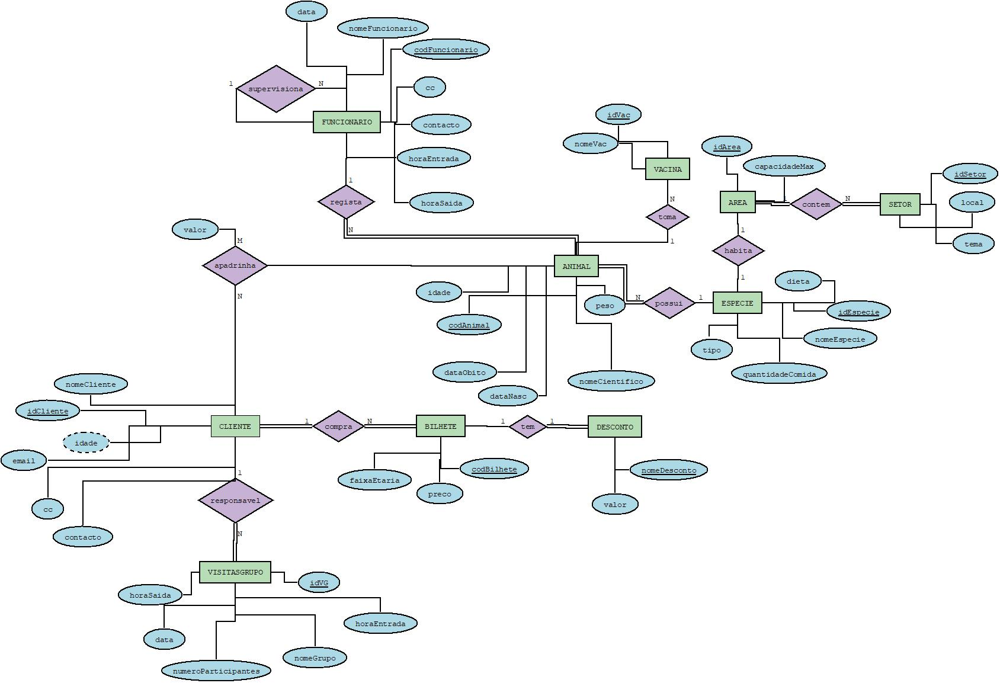

# C2 : Esquema conceptual

## Modelo E/A

 

## Regras de negócio adicionais (Restrições)

• Só vamos registar um contacto para cada cliente.

• Só vamos registar um contacto para cada funcionário.

• Só vamos registar um email para cada cliente.

•	Apenas o gerente pode acrescentar animais (oriundos de outros zoos).

•	Nem todas as espécies de animais podem coabitar num mesmo setor.

•	Os voluntários é o único tipo de funcionário que não tem qualquer acesso à base de dados.

---
[< Previous](rebd01.md) | [^ Main]() | [Next >](rebd03.md)
:--- | :---: | ---: 
