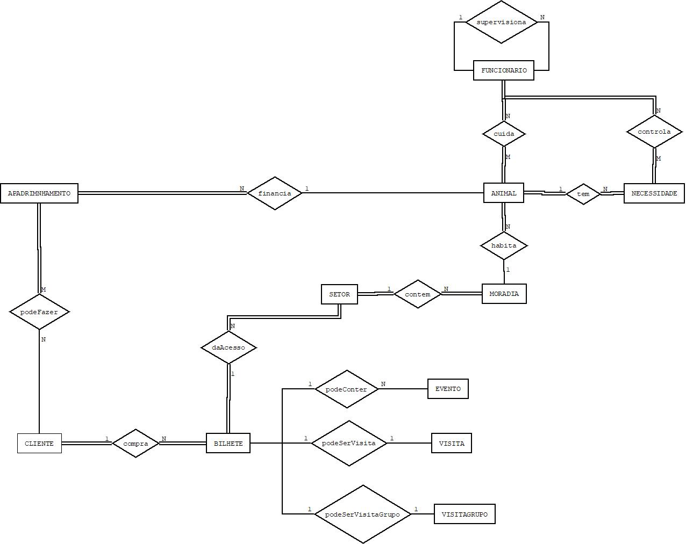

# C3 : Esquema conceptual

## Modelo E/A
### ENTIDADES:

ANIMAL (ID, peso, idade, nomeCientifico, nomePopular, dataObito, vacinacoes, dataNasc, especie)

NECESSIDADE (tipoDieta, quantidadeComida, areaHab)

SETOR (codID, local, tema)

MORADIA (capacidadeMax, especie)

FUNCIONARIOS (nome, CC, funcao, contacto, horario)

BILHETE (codigo, preco, faixaEtaria, desconto)

EVENTOS (tipo, horario, data)

VISITASGRUPO (nomeGrupo, nomeResponsavel, email, contactoTelefonico, numeroParticipantes, data, horaChegada)

APADRINHAMENTO (morada, telefone, ID, valorContribuicao)

CLIENTE (nome, idade, email, CC)

VISITA (hora, data)

### ASSOCIAÇÕES:

cotem (SETOR, MORADIA)

podeFazer (CLIENTE, APADRINHAMENTO)

compra (CLIENTE, BILHETE)

daAcesso (BILHETE, SETOR)

podeConter (BILHETE, EVENTO)

podeSerVisita (BILHETE, VISITA)

podeSerVisitaGrupo (BILHETE, VISITAGRUPO)

financia (APADRINHAMENTO, ANIMAL)

habita (ANIMAL, MORADIA)

cuida (FUNCIONARIO, ANIMAL)

supervisiona (FUNCIONARIO, FUNCIONARIO)

controla (FUNCIONARIO, NECESSIDADE)

tem (ANIMAL, NECESSIDADE)

Exemplo de inserção de uma imagem:   
  

CLIENTE: O Zoo armazena os seguintes atributos dos clientes: nome, idade, email, CC. 

podeFazer: O cliente pode estar associado à entidade APADRINHAMENTO. Apesar de ser necessário um ou mais clientes para um apadrinhamento existir, os clientes não necessitam obrigatoriamente de apadrinhar um animal.

APADRINHAMENTO: Os dados que a base de dados do Zoológico necessita de recolher de forma a ser efetuado um apadrinhamento são a morada do cliente, o telefone, o animal a apadrinhar e o valor a contribuir.

financia: O APADRINHAMENTO permite financiar algumas despesas do animal. Cada animal pode ter um ou mais apadrinhamentos e por sua vez cada apadrinhamento apenas financia um animal. Porém nem todos os animais são apadrinhados. 

ANIMAL: Cada animal é identificado pelo ID, peso, idade, nome científico, nome popular, data de óbito, vacinações e a sua data de nascimento, sendo estes os seus atributos.

tem: Cada animal tem obrigatoriamente necessidades especificas.

NECESSIDADE: De forma a controlar as necessidades de cada animal, a entidade NECESSIDADE tem os seguintes atributos: o tipo de dieta, a quantidade de comida e área de habitação.

controla: As necessidades dos animais têm de ser controladas pelos funcionários do zoo. As várias necessidades podem ser controladas por vários funcionários. 

FUNCIONARIO: O zoo é composto por vários funcionários cujos atributos são o nome, cartão de cidadão, função, contacto e horário de trabalho. Os voluntários são também considerados funcionários no zoo. 

supervisiona: Esta associação serve para os voluntários, que serão supervisionados por um funcionário do zoo. Por sua vez, o supervisor pode supervisionar vários voluntários. 

cuida: São os funcionários que cuidam dos animais. Vários funcionários podem cuidar de um ou mais animais.

habita: Cada animal tem de ser alojado numa moradia, podendo morar um ou mais animais da mesma espécie na mesma moradia. 

MORADIA: A moradia é o espaço onde os animais habitam. Cada moradia é distinguida pela capacidade máxima de animais e a espécie que lá mora.

contem:  As moradias estão contidas em diferentes setores do zoo para uma melhor organização do mesmo. Estas existem obrigatoriamente dentro de um setor. Um setor pode conter várias moradias, porém cada moradia só pode pertencer a um setor.

SETOR: Um setor é caracterizado pelo seu código de identificação, a sua localização e tema.

compra: Esta associação pode ser efetuada por um cliente na compra de um ou mais bilhetes. 

BILHETE: Cada bilhete tem um código, um preço, uma faixa etária e um desconto.

daAcesso: Cada bilhete dá acesso aos vários setores do zoo. 

podeConter: O bilhete pode conter o acesso a um ou mais eventos que decorrem no zoo (a visita esta incluída).

podeSerVisita: O bilhete pode conter apenas a visita ao zoo (sem acesso aos eventos). 

podeSerVisitaGrupo: As instituições, empresas ou escolas que pretendam fazer visitas em grupo tem um bilhete específico.  

EVENTO: Cada evento tem um tipo, um horário e uma data.

VISITA: As visitas são efetuadas numa data e horas específicas.

VISITASGRUPO: As visitas de grupo tem os atributos  nome de grupo (da empresa, escola ou instituição), nome do/a responsável, email, contacto telefónico, o número de participantes, a data da visita e a hora de chegada.

## Regras de negócio adicionais (Restrições)

---
[< Previous](rei02.md) | [^ Main](https://github.com/PaulaMmmm/-tcm22-sibd-g04/tree/main) | Next >
:--- | :---: | ---: 
